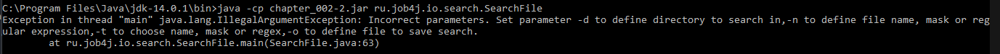

# Утилиты zip и find
[](https://travis-ci.com/saimon494/job4j_design)
[](https://codecov.io/gh/saimon494/job4j_design)
---
# Содержание
1. [Утилита zip](#Утилита-zip)
2. [Утилита find](#Утилита-find)
## Утилита zip

### О проекте
Проект предназначен для архивирования указанной папки с сохранением структуры подпапок.
Есть возможность передать в качестве ключа расширение файлов, которые не нужно включать в архив.
Исходный код проекта в [папке](https://github.com/saimon494/job4j_design/tree/main/chapter_002/src/main/java/ru/job4j/io).
Пример запуска:
```
java -jar chapter_002-2.jar -d=chapter_002 -e=*.xml -o=chapter_002/chapter_002.zip
```
-d - папка для архивации  
-e - файлы для исключения  
-o - папка для сохранения архива   

### Сборка
1. Скачать и установить JDK 14.
2. Скачать из [папки](https://github.com/saimon494/job4j_design/tree/main/chapter_002/target) файл `chapter_002-2.jar`.
3. Перейти в `cmd` в директорию c этим файлом.

### Использование
Архивируем папку chapter_002 командой:
```
java -cp chapter_002-2.jar ru.job4j.io.Zip -d=C:\projects\job4j_design\chapter_002 -e=.xml -o=C:\projects\job4j_design\chapter_002.zip
```


Распаковав полученный архив, можно убедиться, что в нём отсутствуют файлы с расширением xml.


## Утилита find

### О проекте
Проект предназначен для поиска файлов в заданном каталоге и подкаталогах.
Имя файла может задаваться целиком, по маске, или по регулярному выражению. Результат поиска записывается в выходной файл.
Есть валидация входных параметров. Исходный код проекта в 
[папке](https://github.com/saimon494/job4j_design/tree/main/chapter_002/src/main/java/ru/job4j/io/search). 
Пример запуска:
```
java -jar chapter_002-2.jar -d=c:/projects/job4j_design/ -n=log.txt -t=name -o=searchResult.txt
```
-d - папка для поиска  
-n - имя файла, маска, либо регулярное выражение  
-t - тип поиска: name - по полному совпадение имени, mask - по маске, regex - по регулярному выражению  
-o - имя файла для записи результата

### Сборка
1. Скачать и установить JDK 14.
2. Скачать из [папки](https://github.com/saimon494/job4j_design/tree/main/chapter_002/target) файл `chapter_002-2.jar` и скопировать его в 
`C:\Program Files\Java\jdk-14.0.1\bin`.

### Использование
Запускаем из `cmd` поиск файла командой:
```
java -cp chapter_002-2.jar ru.job4j.io.search.SearchFile -d=C:/projects/job4j_design/ -n=log.txt -t=name -o=searchResult.txt
```

Результат поиска сохранился в файл:  


В нем содержится путь к искомому файлу:  


Если запускать поиск без параметров, то в сообщение об ошибке будет указано как их задать.  




## Контакты
[](https://t.me/Saimon494)